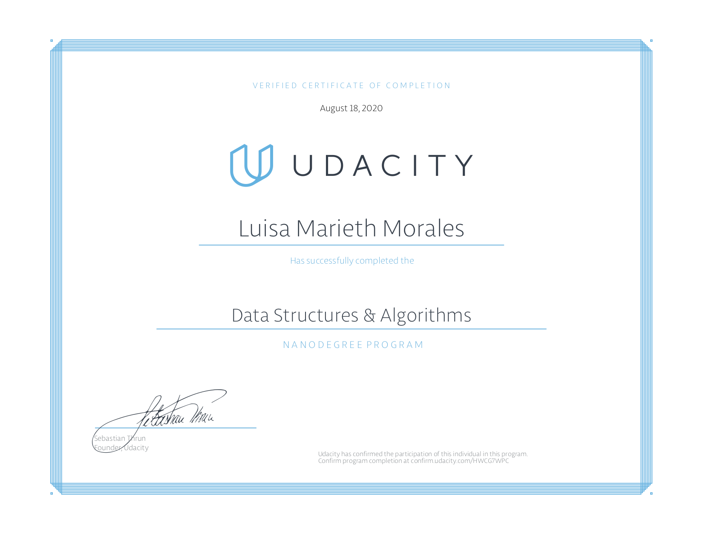

# Data Structures & Algorithms Nanodegree Program

This repo contains all the practice problems and project work completed as part of my Udacity nanodegree program.

Part 1: Introduction
  - Python refresher
  - Learned basic problem solving skills
  - Learned how to calculate an algorithms time and space complexity
  - Project: [Unscramble Computer Science Problems](/projects/P0_intro)

Part 2: Data Structures
  - Learned about core data structures: Arrays, Linked Lists, Stacks, Queues, Trees, and Maps and Hashing
  - Project: [Show Me the Data Structures](/projects/P1_data_structures)

Part 3: Basic Algorithms
  - Learned common sorting algorithms, binary search, tries, heaps, Red-Black trees, and self-balancing trees
  - Project: [Problems vs. Algorithms](/projects/P2_basic_algos)

Part 4: Advanced Algorithms
  - Learned depth-first search, breadth-first search, Dijkstras Algorithm, Prim's Algorithm, and A* Search
  - Learned about dynamic programming techniques
  - Project: [Route Planner](/projects/P3_route_planner)

## Certificate of Completion

